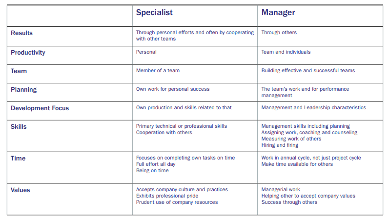
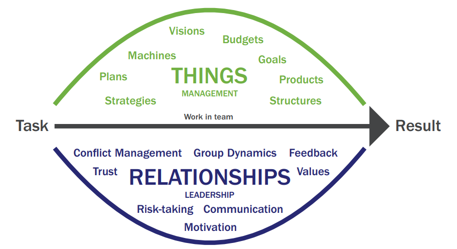

# three-psychological-obstacles
- What you get acknowledgement for? Being a specialist or a manager?
- Wanting to belong: Face to the fact, talk about expectation
- I am the only one who is uncertain: be honest to yourself, ask for help

# assessment-leadership-skills
- Coaching

How skilled are you at asking questions that help other people perform better, reach better results and use more of their potential?
- Delegation

How good are you at helping others understand what specifically needs to be done, why it needs to be done and how progress will be measured and evaluated? 

- Organizational Knowledge

How well do you know your organization’s vision, overall goals and values as well as your organizational structure and how the different parts of the organization play together?
- Vision and Strategy

How good are you at crafting a vision for your team that is inline with the overall vision as well as formulating and planning strategies to fulfill that vision? 
- Operations Planning

How skilled are you at planning the operations of an entire team in a way that is inline with the overall objectives of the organization and creates a clear, actionable path forward that can be precisely evaluated?
- Goal Setting

How well are you able to set specific, measurable and inspiring goals for yourself and for others?
- Follow Up

How skilled are you at following up with others on their goals and planned activities in a way that ensures optimal performance, growth and acknowledgement?

- Prioritization

How good are you at prioritizing the use of your time so you do not get swamped by ineffective tasks and are able to free up plentiful time for the leadership of your team members and your organizational responsibilities?
- Motivation

How well can you inspire yourself and others to go above and beyond as well as turning on the inner drive in other people by connecting to their sense of purpose and meaning?
- Relationship Building

How skilled are you at building trusting and respectful relationships with team members and other people in your organization, both those who you find it easy to interact with and those that provide you more of an interpersonal challenge? 
- Communication

How well are you able to communicate your opinions, ideas and directives clearly, to give and take constructive feedback and to truly listen to others with presence and without prejudice? 

- Conflict Management

How good are you at seeing the issues at hand, daring to bring them out into the open and dealing with them in a way that promotes understanding and progress rather than fear and locked positions?
- Decision Making

How skilled are you at within a reasonable time collecting the needed facts and then based on those facts and on your inner compass making clear cut and timely decisions in the perceived best interest of the overall picture? 
- Performance Appraisals

How good are you at regularly evaluating the performance of others and in a conversation based on mutual responsibility rewarding beneficial behavior as well as creating actionable plans for improving less beneficial behavior?
- Authenticity

How willing are you to be your true self in your leadership as well as to be open about both your strengths and your shortcomings?

# The boss contract
- What is your framework?
- What are the expectations?
- Which support can you get from the organization?
- What mandates or authorities do you have?
- Which ways of working are preferable?
- Which values does the organization have?
- Which rules or guidelines apply to your work?
- Do you have the same picture of your overall task?
- Are the expectations of you clear?
- What are your circumstances?
- How is the contract going to be followed up upon?

# New Skill Set

# Two dimensions teamwork

# The difference between management and leaderships
## Management
- Posision: Appointment from above in organisation
- Organizing things: in the Things dimension, a role
- Formal
## Leadership
- Relationship: vote of confidence from other people
- Relating, influencing: in the relationships dimension
- Informal
# The four level of communication

- **Nothing**: The first level is when we talk about Nothing. This is the first and shallowest level of communication. A common topic on this level is talking about the weather. It means we are talking about nothing, something
- **Something**: The second level of communication is where we talk about Something. And something in this case can be our favorite sports team. It can be about the organizational chart. It can be about the meeting yesterday or about the new computer system. We talk about something on this second level of communication which is slightly deeper than the first level. It says a bit more about the persons engaged in the communication, but it is still not a very deep level of communication
- **Somebody**: The third level of communication is when we talk about Somebody. Now we’re getting down to a bit of a deeper level, a more direct level of communication. Somebody means we are talking about somebody who is not in the communication, not in the conversation. We could for example be talking about the boss, if he or she is not present. We could be talking about another coworker or about our kids.
- **You and I**:The fourth and deepest, most direct level of communication is called You and I. This is where we talk about you and I. Feedback for example, ends up on this level. When I give you feedback or you give me feedback. It’s a very direct, effective communication when we want to develop a relationship and deepen an interaction with another person.

# Having a clear outcome
- **Something easily gets missed**: Sometimes people go into a conversation and they have no idea what they want out of it
- **To be an effective communicator**: Make your desired outcome crystal clear for yourself and watch your communication skills improve along with it.

# The arrow of credibility
- **Step 1: Sensation** Meaning something you experience with your five senses. You smell, touch, see and so forth. You have some sort of sensation somewhere in your body. 
- **Step 2: Awareness** In the second step, you can choose to become aware of that “oh, I have a pressure in my stomach” or you might not.
- **Step 3: Insight** Maybe I’m having too much to do at work.” That could be one example of an insight in step three.
- **Step 4: Action** 
- **Step 5: Effect** To really be the one who increases the chances of other people trusting you or perceiving you as a credible person, you also need to take responsibility for the effects that your actions are having

# Confict Management
## Incompatible Strategies
## The five confict styles
- Fight: In a conflict situation if I prioritize my needs first, or my goals, then I would most likely choose the first conflict style which is called to fight.
- Adapt: On the other hand if I choose a style that focuses completely on the needs of the other person or persons then I choose the style called to adapt. Meaning I forgo my own needs and instead focus on the other person’s needs.
- Avoid: I could also choose to not focus on neither my needs or the needs of the other person. In that case I would choose to simply avoid the conflict. The third style is therefore called to avoid. 
- Compromise: The fourth style is if I make sure I get it a little bit the way I want it, while also making sure other people get a little bit of what they want and need. Then we have a style called to compromise. Compromise often feels like I get a little bit of what I want, but not completely what I really wanted
- Cooperate: The fifth style is when I make sure to fulfill both my needs and the needs of the other person or persons involved. This is called to cooperate. I achieve my goals, the things I want and need, while I also prioritize the relationship and meeting the other person’s needs. 

# Motivation
## Communication the big picture
"I'm building a cathedral"
## Clarify what is lacking to help others improve
Skill and Will

# Leadership dilemmas
- Mission: Change or Maintain
- Goal setting: Open for new options or stay on the current course
- Relations: be close or keep distance
- Inderdependence: as for help or teach others
- Decisions: Decide yourself or delegate
- Pace of change: fast or slow
- Confidence: fire team members or develop team members
- Loyalty: Support your team or serve upwards

# Four parts of management
- Managing Relationships
- Relating to a Framework 
- Delivering Results
- Leading the operataions in a Direction

# Responsibilities as a Manager
https://www.risely.me/responsibilities-of-a-manager-7-secrets-to-success/

Maintains staff by recruiting, selecting, orienting, and training employees. Ensures a safe, secure, and legal work environment. Develops personal growth opportunities. Accomplishes staff results by communicating job expectations; planning, monitoring, and appraising job results.

Planing, Organizing, Staffing, leading, Controlling
- Hiring the right people for the team according to skill and behavior gaps
- Leading and motivating the team
- Setting and communicating the team’s objectives and goals.
- Setting individual objectives/goals and aligning them with the team’s goals
- Planning and organizing workflows
- Monitoring progress and ensuring goals are met
- Developing and coaching team members
- Making sure the team’s employee experience remains high and employee turnover remains low

# Authorities as a Manager
 Your authority isn’t just about giving orders; it’s your power to steer the ship, make decisions, and lead your team to victory. Think of it as the captain’s hat on your head, guiding everyone towards a common goal.
