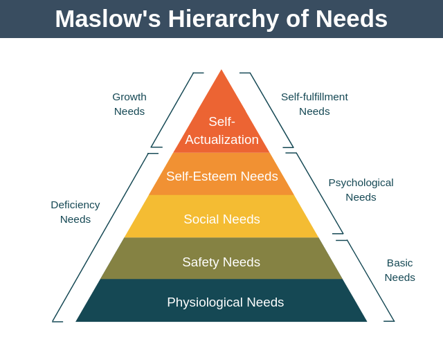

- According to Maslow, we have five categories of needs: physiological, safety, love, esteem, and self-actualization.

- In this theory, higher needs in the hierarchy begin to emerge when people feel they have sufficiently satisfied the previous need.

Reference: [Maslow's hierarchy of needs](https://www.thoughtco.com/maslows-hierarchy-of-needs-4582571)