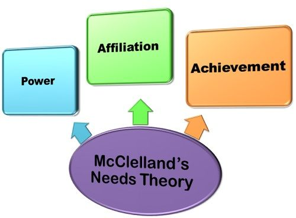

https://educationlibrary.org/mcclellands-three-needs-theory-power-achievement-and-affiliation/

# Need for Achievement (nACH)
Personal responsibility, Feedback, Moderate risk

- Typical behaviors - High: Must win at any cost, must be on top, and receive credit.
- Typical behaviors - Low: Fears failure, avoids responsibility.
# Need for Power (nPOW):
Influence, Competitive

- Typical behaviors - High: Demands blind loyalty and harmony, does not tolerate disagreement.
- Typical behaviors - Low: Remains aloof, maintains social distance.
# Need for Affiliation (nAFF):
Acceptance and friendship, Cooperative

- Typical behaviors - High: Desires control of everyone and everything, exaggerates own position and resources.
- Typical behaviors - Low: Dependent/subordinate, minimizes own position and resources.