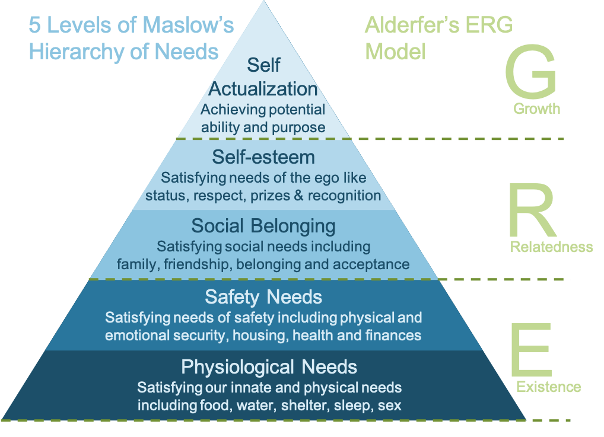

Alderfer’s ERG theory of motivation builds on Maslow’s Hierarchy of Needs and states that humans have three core types of need: Existence, Relatedness and Growth. These needs may be of different levels of priority for different individuals, and their relative importance for an individual may vary over time.

