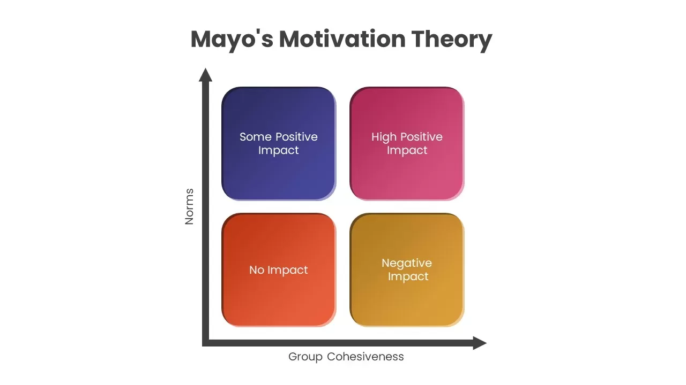

https://www.business.com/articles/management-theory-of-elton-mayo/

Mayo’s management theory states that employees are motivated far more by relational factors such as attention and camaraderie than by monetary rewards or environmental factors, such as lighting, humidity and more.

Mayo’s theories identify a “norm” through the degree to which a group encourages positive or negative behaviors. This is typically expressed through an employee handbook or workplace policies and can include formal or informal rules.

Group cohesiveness is how a group cooperates together, defined as a group’s overall comradery or level of teamwork.

The following are the four combinations of a group’s norm in relation to its cohesiveness:

- **Low norm and low cohesiveness:** This group is ineffective and has a minimal impact since none of the members are motivated to excel.
- **Low norm and high cohesiveness:** This group has a negative impact since fellow members encourage negative behavior. In a typical workplace, an example would be a group that gossips together and actively fights against management — a group with high comradery and low structure. 
- **High norm and low cohesiveness:** This group has a small degree of positive impact through individual member accomplishments. Each employee must maintain a high standard of work but does not cooperate as part of a team.
- **High norms and high cohesiveness:** This group has the greatest positive impact, is held to a high standard and works together to achieve its goals. 
