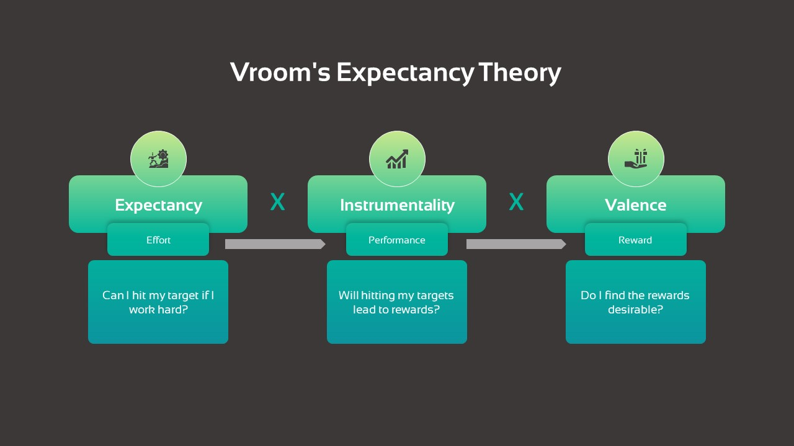

https://slidebazaar.com/items/vrooms-expectancy-theory/

Vroom's expectancy theory states people's motivation depends on expectancy, instrumentality, and valence. He correlates these factors with workplace motivation. If an employee can make choices in their work, obliviously, they will choose the element that motivates them most. That means employees rationally consider the relative attractiveness of all possible incentives and outcomes of an action. Besides, the individuals or the employees also consider how much performance and effort must be put in for that desirable outcome.

Three elements of Vroom’s expectance theory

- **Expectancy:** This is an expected outcome that employees look to get from their efforts. It is related to good performance. It is also connected with the level of difficulty and what he experiences. Organizations should be focused on which factors can motivate the employee to get his best possible performance. So, the theory states there is a correlation between performance and sources of motivation. Victor V rooms claim that more efforts lead to better performance.

- **Instrumentality:** Instrumentality means that employees will likely receive a reward if the performance expectation is achieved. Organizations can motivate employees by making promises of extra rewards such as promotions or bonuses.

- **Valence:** Individuals value rewards based on their goals, needs, and sources of motivation. So, the value of rewards is differently perceived by individuals. For example, some prioritize money, while others want recognition. So, it is important to find out employee values to frame a source of motivation. 