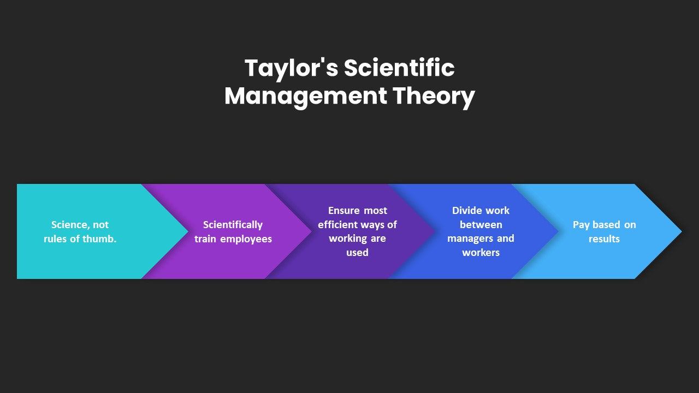

https://slidebazaar.com/items/taylors-scientific-management-theory/

Key takeaways of Tylor’s scientific management theory

- Breakdown job into subsets
- Give responsibility and train workers
- Monitor performance
- Allocate jobs between managers and employees
- Pay based on results

Functions of the Scientific Management Approach

- According to the skills and talents, an employee must be selected.
- Incentives and rewards have to apply to improve their output and encourage them.
- Implementing those techniques should be based on scientific tasks.
- Sensibly observe eradicating disruptions when the plan runs.
- Develop standard leadership to direct goal achievement