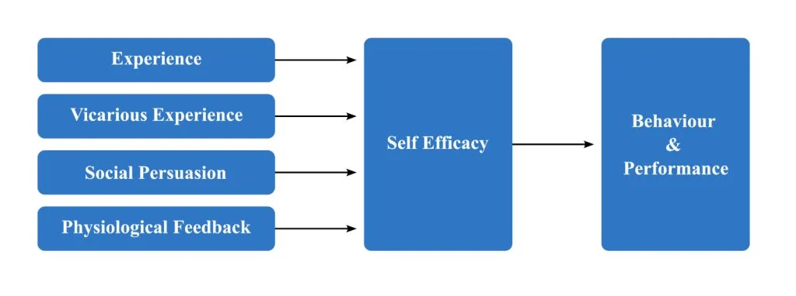
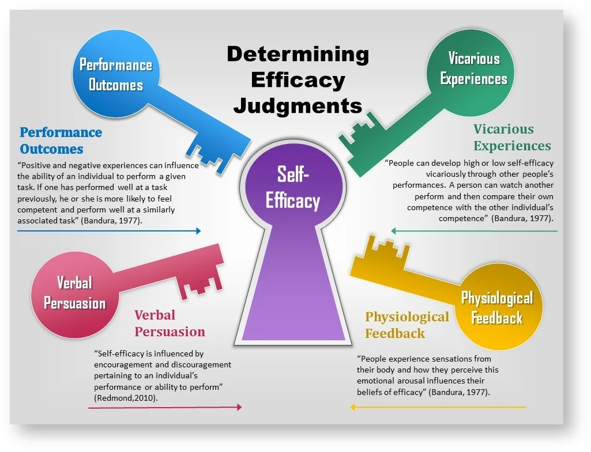

https://www.simplypsychology.org/self-efficacy.html

- Psychologist Albert Bandura has defined self-efficacy as people’s belief in their ability to control their functioning and events that affect their lives.
- One’s sense of self-efficacy can provide the foundation for motivation, well-being, and personal accomplishment.
- People’s beliefs in their efficacy are developed by four primary sources of influence, including (i) mastery experiences, (ii) vicarious experiences, (iii) social persuasion, and (iv) emotional states.
- High self-efficacy has numerous benefits to daily life, such as resilience to adversity and stress, healthy lifestyle habits, improved employee performance, and educational achievement.

